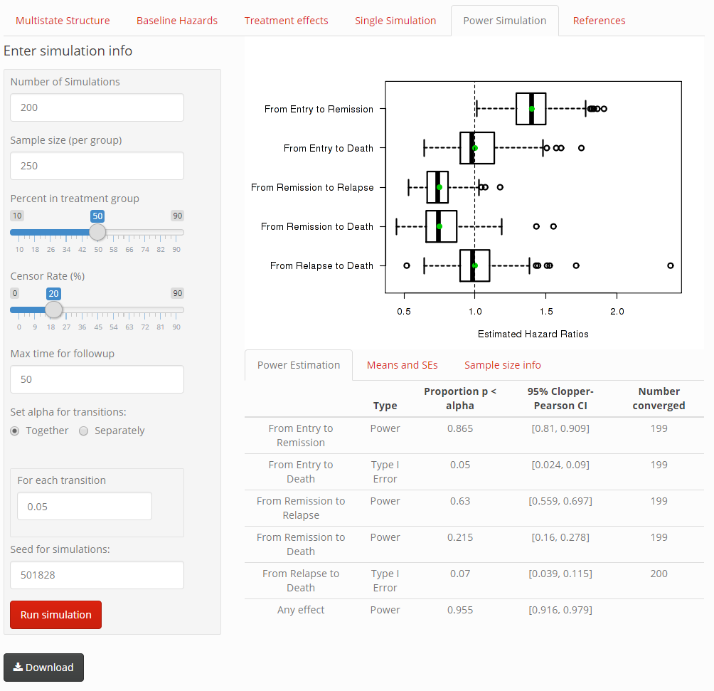

# MSDshiny -- The Multistate Simulation Designer `shiny` Application

The Multistate Simulation Designer application provides a useful and streamlined way to plan and power clinical trials with multistate outcomes. This readme is a tutorial on the application. A pdf version of this tutorial is available for download on the "references" tab of the app (located in the www/ subdirectory).

# Background 

It is difficult to plan and power clinical trials with multistate endpoints; more assumptions are required and there is no available software to compute the power for a wide range of possible studies. The Multistate Simulation Designer `shiny` application is an attempt at reconciling this concern. 

This `shiny` app was developed with the goal of aiding in the planning and powering of clinical trials with multistate outcomes. The app allows for users to explore various multistate structures, and within them to explicitly visualize the assumptions they are making when it comes to baseline hazards and assumed treatment effects. Once all of the assumptions are made, it is straightforward to perform a simulation of either a single study (which provides a snapshot of the results from an actual study if it was to be performed), or a large set of studies (which provides information on the power to detect treatment effects and the variability in the estimates from the study). The simulated data set for a single study can be downloaded directly from the application. The coefficients and the p-values from the simulated power-analysis can be downloaded as well. This is a tutorial on how to utilize the Multistate Simulation Designer. 

# Getting Started

It is straightforward to initiate an instance of the Multistate Simulation Designer using the 3 steps below (it is assumed that R is installed and an internet connection is available):

1) Open an R session
2) Make sure `shiny` is installed and loaded:

`if(!require(shiny)) install.packages('shiny')`

`library(shiny)`

3) Run the code: 

`
runGitHub("petersonR/MSDshiny")
`

Note that the app is optimized for Google Chrome, and some features may be limited in other browsers. Additionally, the first time this is run on a new machine may take a minute to install the required packages.

# Using the application

## Overview

The overall structure of the application is evident in the screenshot above. First, a user is prompted to input the number of states, the names of those states, the color of them (for future plots) and the transitions that are possible. Second, the user goes through the assumptions they have relating to each transition's baseline hazard and an assumed treatment effect (if applicable). Third, they can run a single simulation, which should aid in determining if the settings are acceptable as well as give a sense of the pattern that they should expect when they run this study. Fourth, they can replicate the study as many times as they want to get an idea of the power and the properties of the coefficients in their final analysis. The data generated from the latter two steps is available for download, and the seed can be set at each step for the sake of reproduceability. 

The app uses "tabs" to navigate the user through the design process. These tabs include:

- Multistate Structure 
- Baseline Hazards
- Treatment Effects
- Single Simulation
- Power Simulation
- References

Each of these are described in more detail in the subsections that follow. Note that although there is a straightforward way of working through the application from the left to right along the tabs, thanks to the interactivity enabled by `shiny`, users are free to change settings in previous tabs; they will automatically update everywhere else in the app. Nonetheless, in this tutorial, we go through the "recommended" directions to take through the application.

## Multistate Structure

The Multistate Structure tab shown in Figure 1 is the first and most important tab in the app, since all of the other tabs depend heavily on it. In this tab, users can perform all of the following:

1) Set the number of states in the multistate model: Currently, the application can handle between 2 and 5 states. Note that if this is changed *after* other parameters in the app have been set, this will reset all of the current settings.
    
2) Name these states something other than the defaults. By default, states are numbered "Stage 1, Stage 2, ...", but renaming states is important for readability and interpretation later on.
    
3) Pick colors for these states. These colors are used in visualizations and aid in interpretation. Note the first stage is never transitioned to, so users cannot set its color.
    
4) Mark the transitions that are possible or not. This is a sequence of grouped checkbox inputs where users can check boxes that enable the possibility of transitions. Users may want to avoid models that are not complete (models where subjects don't have a defined entry and final state), as these will likely lead to errors later on in the simulations. 
  
5) Verify that the multistate model is correctly specified in the plot. The multistate plot on the page is adaptive to the settings in 1-4, and is generated via the R package `diagram`.

## Baseline Hazards

The Baseline Hazards tab shown in Figure 2 is where users can set there primary assumptions about the distributions of the survival time. Currently (as of version 1.0) only Weibull distributions are supported. The mathematical parameterization is presented on the `shiny` application page for those that are interested, however it is likely easiest to change the inputs on the left and verify them visually in the plots on the right. 

The number of plots and transitions that show up on this page depends on the "Multistate Structure" tab. For each "starting" group (i.e., groups from which subjects can transition), there is a plot containing lines that represent transitions out of that starting group. 

One thing to note from here on is that the scale of "time" in this application is internally consistent in the app, so users can interpret it as whatever unit they would like so long as they do so consistently throughout the application. In this tutorial, we refer to it as months.

(Note: If reading this on GitHub, inline math is not yet supported at the time of writing, so the formulas may not appear correctly. If this is a concern, please see the pdf version of this tutorial in the www/ subdirectory.)

The inputs on this page are: 

1) Transition-specific $\lambda$'s and $\gamma$'s for the time-to-event generating distribution.  For each transition, users can set the time-to-event distribution parameters and confirm them in the plot on the right. Higher values of $\lambda$ increase the hazard (given $\gamma$), whereas changing the value  of $\gamma$ will change the shape of the distribution. The Weibull distribution as parameterized here has two limits: $\lambda > 0$ and $\gamma > 0$. Thus if a user attempts to select 0, the internal value gets changed to the `.Machine\$double.eps` value (if this does happen, it is likely that the models fit later on will have trouble converging for this transition). Users should avoid leaving these fields blank as it may cause the application to perform unexpectedly.
    
2) Plot type: The user has the option of visualizing the assumed transition-specific generating distributions via plots of the survival curves, the hazard curves, or the cumulative hazard curves.
      
3) Max time plotted: Since there are no non-mathematical limits on the distributional parameters, it is possible that the default time-range of 15 months is not large or small enough; this input allows users to vary the limits on the time axis.

## Treatment Effects

The Treatment Effects tab shown in Figure 3 is quite similar to the Baseline Hazards tab, with the main difference being the inputs -- on the left here, the user can set the hypothesized hazard ratio between the control group and the placebo group that will be used for the generating distribution. 

When a user changes any hazard ratio away from 1, they will be able to see a new (dotted) line for the treatment group corresponding to that particular transition. If they set the hazard ratio to 1 for all treatment effects, this will lead to the analysis calculating the type I error for the study as a whole.

## Single Simulation

The Single Simulation tab shown in Figure 4 has the following fixed inputs:

1) Sample size (per group): Select the number of subjects per group for a single simulated 
   data set (total = N x 2). If the percent in treatment group is not 50 %, this number is 
   fixed at N x 2, but the number is no longer "per group".
   
2) Percent in treatment group: The balance of randomization between treatment and placebo.

3) Censor Rate (%): The target censoring percentage (Observed rate may be different if the max time for followup is short relative to the events occurring). The censoring is accomplished as follows:
    i. Convert the rate (%) into odds, define as $c$.
    ii. For each transition to the final (absorbing) state, multiply the transition 
        $\lambda$ parameter by $c$.
    iii. Generate censor times based off Weibull distribution with rate $c\lambda$ and 
         the same $\gamma$ as is specified for that transition.
    iv. This will lead to on average the correct percentage of censored observations. 
    
In other words, each state's transition to the final state has a "connected" censor hazard designed to yield the correct censoring rate. This tends to work well; the censoring distribution is thus a piece-wise Weibull distribution that depends on the risk of exit in each state.  However, some specific multistate designs could have issues if there are no transitions to the final state from a particular state, as in this scenario there will be no censoring out of that state. 
    
4) Max time for followup: The maximum time on study after which point all subjects will be censored.

5) Seed for simulation: The seed for this single simulation (this ensures future runs will produce the exact same values, given the same input parameters).

6) Run simulation: Run the simulation according to the parameters on this and previous pages. Note that if a user goes back and changes parameters after hitting this button, the current plots will disappear and the download button will be disabled until this action button is pressed again, thereby re-simulating given the new parameters.

7) Download button: Download the simulated data. The file downloaded is a .RData file containing a list named "sim1Results" with the contents: simResults (a data frame of observed transitions for all subjects), params (a data frame of the survival parameters used to run the simulations), and simDetails (a list containing the additional simulation inputs in this tab).

The output presented in the Single Simulation tab is dynamic; it contains the following elements:

1) Input for Max time plotted 

2) A "Current State Plot" (description) For more details see the documentation for the 
   `survival` package
   
3) A "tabset Panel" with results tables produced by the simulation, containing four tables of results. First, there is a table of the transitions observed in the simulated data set (can be toggled to rates with an action button). Second, there is a table of observed receiving group events by treatment group (can be toggled to rates with an action button). Third, a summary of the `survfit` multistate object featuring the restricted mean time in state, and a dynamic numeric input for "Max time for restricted mean" which is fed into `summary.survfit` that produces this table. This is useful for users to see how these restricted means change as the max time changes. Last, there is a Cox model summary - this is a Cox model that treats each transition separately (see `survival` and `mstate` documentation for more details).

## Power Simulation

The Power Simulation tab shown in Figure 5 is set up similarly to the Single Simulation tab, only now we are replicating the single simulation many times. The inputs and outputs that are *not* described for the single simulation tab are described in more detail below:

1) Number of Simulations: The number of full data sets to simulate (this would be akin to running the study X amount of times).

2) Significance level: For the power calculations, this refers to the significance level for a 2-sided test of null hypothesis for each separate transition. Note that this can be changed after the simulations have been run.

3) Run simulation: Depending on how many simulations one performs (and how complex the multistate structure), this could potentially take a while. When the button is pressed, a progress bar will be displayed in the lower right hand corner of the screen.

4) Download: The file downloaded is a .RData file containing a list called "sim2Results" with the following components: simResults (a data frame storing all the coefficients, p-values, and convergence messages from each simulated data set), params (a data frame of parameter values from the previous tabs), and simDetails (a list containing the simulation inputs in this tab).

Once a user hits "Run simulation", then the output appears. The first piece of output is a series of box plots of the estimated hazard ratios for all simulations. Specifically, the Cox PH multistate models are calculated and the estimated hazard ratios between treatment and placebo group for each transition are recorded and plotted here. Green dots indicate the "Truth" according to the assumptions made in the "Treatment Effects" tab. Note that in some cases, points are omitted if some models fail to converge (as is often the case when some transitions are rare).  If this happens, a note will appear on the plot. 

We also produce a summary table of results. This table contains six useful characteristics of the simulation set and statistics about the results. First, we show the The true hazard ratio: this is equal to what is set in the "Treatment Effects" tab. Next, we present the geometric mean estimated HR, which refers to the geometric mean of the hazard ratios over all simulations (i.e. $e^{\bar \beta}$) where $\bar\beta$ is the mean coefficient over all Cox regressions. Second, we present the geometric standard deviation of the hazard ratios over all simulations (i.e. $e^{\text{sd} (\beta)}$) where $\beta$ is the transition-specific coefficient. Third, we display the proportion of hypotheses rejected: If the true HR = 1, this is the Type 1 error for this transition. If the true HR is not 1, then it refers to the power. Simply put, it is the proportion of times that the null hypothesis (no transition-specific treatment effect) is rejected at the significance level set in the inputs. Perhaps of more interest in what is shown in the next column, 95% Clopper-Pearson confidence intervals for the proportion rejected. This uses properties of the binomial distribution to produce an interval that guarantees that the confidence level is at least 95% (it's a conservative interval, but setting a higher number of simulations will shrink it). Lastly, sometimes it is useful to know if there are any convergence issues; the last column contains the number of converged estimates. Note that if this number is not equal to the number of simulations, there could be problems with some of the fits. The downloaded file contains error/warning codes in sim2Results\$simResults\$converged if a user is curious as to why some fits failed.

This last row in the table contains the power information of any treatment effect being selected at the level specified. This row is especially useful to determine the family-wise error rate in any multistate study; by setting the treatment effects all to one, and looking at the proportion of any tests rejected, this gives an estimate of the family-wise error rate.

# Conclusion

The Multistate Simulation Designer application provides a useful and streamlined way to plan and power clinical trials with multistate outcomes. It also allows for a straightforward way of investigating the impact of multiple comparisons in these multistate analyses. 
